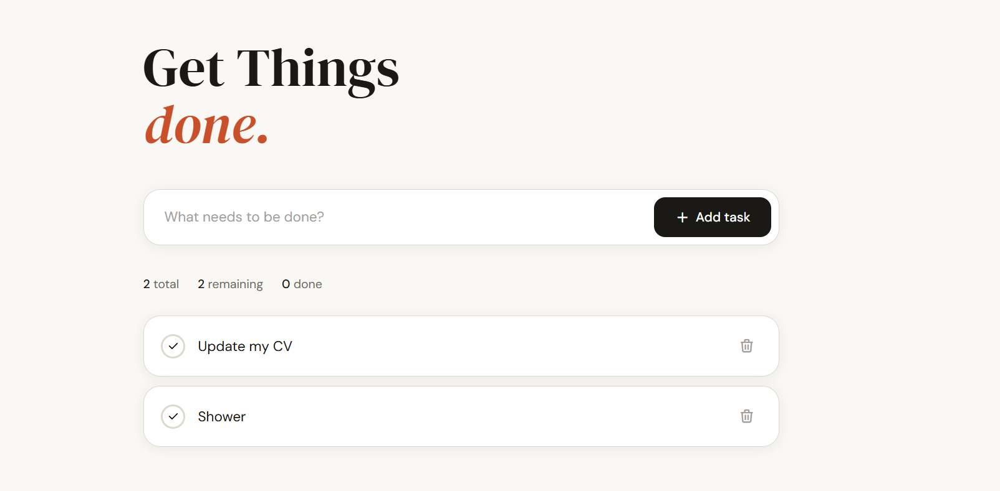

# Things — A Minimal Task Manager

A clean, modern to-do web application built with Spring Boot and Thymeleaf.
Supports adding, completing, and deleting tasks with a warm, editorial UI.

## Tech Stack

- **Java 21**
- **Spring Boot 3** — application framework
- **Spring MVC** — request handling and routing
- **Spring Data JPA** — data persistence layer
- **Hibernate** — ORM
- **Thymeleaf** — server-side HTML templating
- **Bootstrap 5** — base layout and responsive grid
- **Lombok** — boilerplate reduction (@Data, @RequiredArgsConstructor)
- **H2 / your DB** — database (configure in application.properties)

## Features

- Add new tasks
- Toggle tasks between pending and completed
- Delete tasks
- Live stats bar showing total / remaining / done counts
- Completed tasks grouped separately with strikethrough styling